### ARRAY

#### Sorted Squared Array

You are given an array of Integers in which each subsequent value is not less than the previous value. Write a function that takes this array as an input and returns a new array with the squares of each number sorted in ascending order.

##### Clarifying questions:

- Can the input array be empty? - yes
- Can the input array contain negative numbers? - yes
- Can the input array contain duplicates? - yes

```js
// Method 1
// Time: O(nlogn) - Space: O(n)
function sortedSquared(array) {
  const newArray = new Array(array.length).fill(0); // Space: O(n)
  // Time: O(n)
  for (let i = 0; i < array.length; i++) {
    newArray[i] = Math.pow(array[i], 2);
  }
  newArray.sort((a, b) => a - b); // Time: O(nlogn)
  return newArray;
}

// Another solution
function sortedSquared(array) {
  const newArray = array.map((item) => item ** 2).sort((a, b) => a - b);
  return newArray;
}

// Method 2 - Two pointers: Make use of the fact that the given array is sorted in ascending order
// Time: O(n) - Space: O(n)
function sortedSquared(array) {
  const newArray = new Array(array.length).fill(0);
  let pointerLeft = 0;
  let pointerRight = array.length - 1;
  for (let i = array.length - 1; i >= 0; i--) {
    if (Math.abs(array[pointerLeft]) > Math.abs(array[pointerRight])) {
      newArray[i] = array[pointerLeft] ** 2;
      pointerLeft++;
    } else {
      newArray[i] = array[pointerRight] ** 2;
      pointerRight--;
    }
  }
  return newArray;
}

let a = [1, 3, 4, 5];
let b = [-7, -2, 3, 4, 9];
let c = [];

console.log(sortedSquared(a)); // [1, 9, 16, 25]
console.log(sortedSquared(b)); // [4, 9, 16, 49, 81]
console.log(sortedSquared(c)); // []
```

#### Monotonic Array

An array is monotonic if it is either monotone increasing or monotone decreasing. An array is monotone increasing if all its elements from left to right are non-decreasing. An array is monotone decreasing if all its elements from left to right are non-increasing. Given an integer array return true if the given array is monotonic, or false otherwise.

##### Clarifying questions:

- Is an empty array considered monotonic? - yes
- Is an array with only 1 integer considered monotonic? - yes

```js
// Time: O(n) - Space: O(1)
function checkMonotonic(array) {
  const first = array[0];
  const last = array[array.length - 1];

  if (first === last) {
    for (let i = 0; i < array.length - 1; i++) {
      if (array[i] !== array[i + 1]) return false;
    }
  } else if (first < last) {
    // Increasing
    for (let i = 0; i < array.length - 1; i++) {
      if (array[i] > array[i + 1]) return false;
    }
  } else {
    // Decreasing
    for (let i = 0; i < array.length - 1; i++) {
      if (array[i] < array[i + 1]) return false;
    }
  }
  return true;
}

let a = [1, 2, 2, 3];
let b = [6, 5, 4, 4];
let c = [1, 2, 3, 1, 4];
let d = [];
let e = [4];

console.log(checkMonotonic(a)); // true
console.log(checkMonotonic(b)); // true
console.log(checkMonotonic(c)); // false
console.log(checkMonotonic(d)); // true
console.log(checkMonotonic(e)); // true
```

#### Rotate Array

Given an array, rotate the array to the right by k steps, where k is non-negative. Eg. [1, 2, 3, 4, 5, 6, 7] and k = 3, the output should be [5, 6, 7, 1, 2, 3, 4].

##### Clarifying questions:

- What happens if an empty array is given? - return the empty array
- If k=0, no rotation is to happen? - yes

```js
// Method 1 - Time O(n) - Space O(n)
const rotateArray = function (array, k) {
  const length = array.length;
  k = k % length;
  const i = length - k;

  const left = array.slice(0, i);
  const right = array.slice(i);
  return right.concat(left);
};

// Method 2 - Time O(n) - Space O(1)
const rotateArray = function (array, k) {
  k = k % array.length;
  reverse(0, array.length - 1);
  reverse(0, k - 1);
  reverse(k, array.length - 1);

  function reverse(start, end) {
    while (start < end) {
      [array[start], array[end]] = [array[end], array[start]];
      start++;
      end--;
    }
  }

  return array;
};

let a = [1, 2, 3, 4, 5, 6, 7]; // length = 7
console.log(rotateArray(a.slice(), 3)); // [5, 6, 7, 1, 2, 3, 4] // using a.slice() to make a copy of the array, because the method 2 modifies the original array.
console.log(rotateArray(a.slice(), 100)); // [6, 7, 1, 2, 3, 4, 5] - 100 % 7 = 2
console.log(rotateArray([], 2)); // []
console.log(rotateArray([1], 2)); // [1]
```

#### Container with most Water

You are given an integer array height of length n. There are n vertical lines drawn such that the two endpoints of the ith line are (i, 0) and (i, height[i]).
Find two lines that together with the x-axis form a container, such that the container contains the most water(depth is constant across containers). Return the area(that the 2 lines and the X axis make) of container which can store the max amount of water. Notice that you may not slant the container.

##### Clarifying questions:

- Dose Y axis count as a wall? - No
- Does a line inside the container affect the area? - No


```js
// Method 1 - Brute force
// Time: O(n^2) - Space: O(1)
const maxArea = function (array) {
  let area = 0;
  for (let i = 0; i < array.length - 1; i++) {
    for (let j = i + 1; j < array.length; j++) {
      const width = j - i;
      const height = Math.min(array[i], array[j]);
      area = Math.max(area, width * height);
    }
  }
  return area;
};

// Method 2 - Two pointers
// Time: O(n) - Space: O(1)
const maxArea = function (array) {
  let area = 0;
  let left = 0;
  let right = array.length - 1;
  while (left < right) {
    const width = right - left;
    const height = Math.min(array[left], array[right]);
    area = Math.max(area, width * height);
    if (array[left] < array[right]) left++;
    else right--;
  }
  return area;
};

let a = [1, 8, 6, 2, 5, 4, 8, 3, 7]; // length = 9
let b = [3, 7, 5, 6, 8, 4]; // length = 6

console.log(maxArea(a)); // 49
console.log(maxArea(b)); // 21
```

### HASH TABLE

#### Two Sum

You are given an array of Integers and another integer targetValue. Write a function that will take these inputs and return the indices of the 2 integers in the array that add up targetValue.

##### Clarifying questions:

- What if no two integers add up to the targetValue? - return an empty array
- Will multiple pairs add up to the targetValue? - no, at most 1 pair
- Are all the integers positive? - no
- Are the integers distinct? - yes
- What if the array is empty? - return an empty array
- Can I add the same number twice? - no

```js
// Method 1 - Brute force
// Time: O(n^2) - Space: O(1)
function findIndicesSum(array, targetValue) {
  for (let i = 0; i < array.length - 1; i++) {
    for (let j = i + 1; j < array.length; j++) {
      if (array[i] + array[j] === targetValue) {
        return [i, j];
      }
    }
  }
  return [];
}

// Method 2 - Hash table
// Time: O(n) - Space: O(n)
function findIndicesSum(array, targetValue) {
  const hashTable = {};
  for (let i = 0; i < array.length; i++) {
    const neededValue = targetValue - array[i];
    if (neededValue in hashTable) {
      return [hashTable[neededValue], i];
    }
    hashTable[array[i]] = i;
  }
  return [];
}

let a = [2, 7, 11, 15];
let b = [3, 2, 4];
let c = [4];
let d = [];

console.log(findIndicesSum(a, 9)); // [0, 1]
console.log(findIndicesSum(b, 6)); // [1, 2]
console.log(findIndicesSum(c, 4)); // []
console.log(findIndicesSum(d, 4)); // []
```

#### Isomorphic Strings

Given two strings s and t, determine if they are isomorphic. Two strings s and t are isomorphic if the characters in s can be replaced to get t. All occurrences of a character must be replaced with another character while preserving the order of characters. No two characters may map to the same character, but a character may map to itself. s and t consist of any valid ascii character.

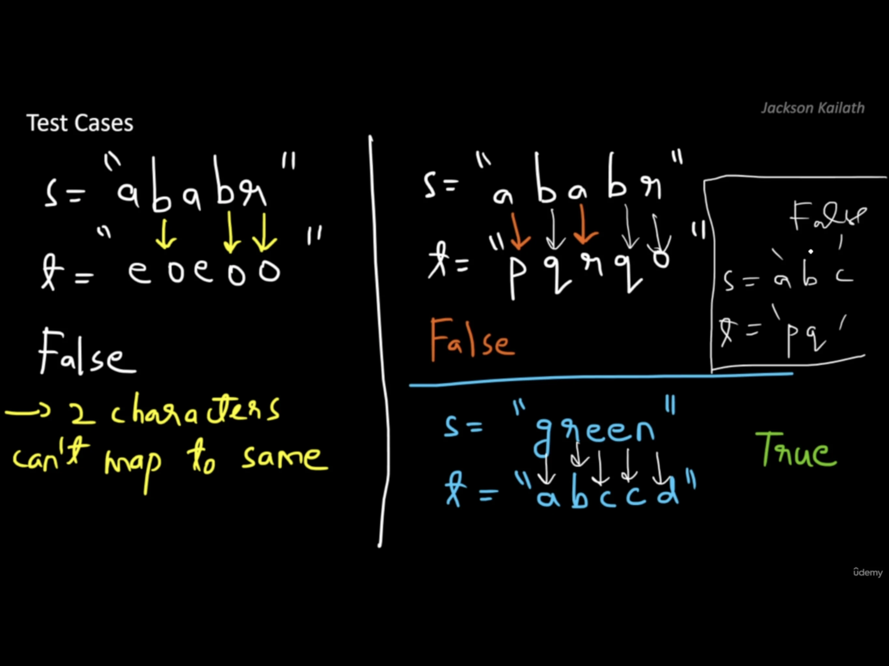

```js
// Time: O(n) - Space: O(1)
// String are made up of 128 ASCII characters, 2 hash tables are ocuppied 256 bytes of memory, so space complexity is O(1)
function checkIsomorphic(s, t) {
  if (s.length !== t.length) return false;
  const hashS = {};
  const hashT = {};
  for (let i = 0; i < s.length; i++) {
    let charS = s[i];
    let charT = t[i];
    if (!hashS[charS]) hashS[charS] = charT;
    if (!hashT[charT]) hashT[charT] = charS;
    if (hashS[charS] !== charT || hashT[charT] !== charS) return false;
  }
  return true;
}

console.log(checkIsomorphic("egg", "add")); // true
console.log(checkIsomorphic("foo", "bar")); // false
console.log(checkIsomorphic("paper", "title")); // true
```

### RECURSION

#### Fibonacci

In the Fibonacci sequence, each subsequent term is obtained by adding the preceding 2 terms. This is true for all the numbers except the first 2 numbers of the Fibonacci series as they do not have 2 preceding numbers. The first 2 terms in the Fibonacci series is 0 and 1. F(n) = F(n-1)+F(n-2) for n>1. Write a function that finds F(n) given n where n is an integer greater than equal to 0. For the first term n = 0.

```js
// Method 1
// Time: O(2^n) - Space: O(n)
function fibonacci(n) {
  if (n <= 1) return n;
  return fibonacci(n - 1) + fibonacci(n - 2);
}

// Method 2 - Memoization
// Time: O(n) - Space: O(n)
function fibonacci(n) {
  const memo = {};
  function fib(n) {
    if (n in memo) return memo[n];
    if (n <= 1) return n;
    memo[n] = fib(n - 1) + fib(n - 2);
    return memo[n];
  }
  return fib(n);
}

// Method 3 - Iteration
// Time: O(n) - Space: O(1)
function fibonacci(n) {
  if (n <= 1) return n;
  let counter = 1;
  let prev = 0;
  let curr = 1;
  let next;
  while (counter < n) {
    next = prev + curr;
    prev = curr;
    curr = next;
    counter++;
  }
  return curr;
}

console.log(fibonacci(6));
console.log(fibonacci(200));
```

#### Power Sum

Let’s define a peculiar type of array in which each element is either an integer or another peculiar array. Assume that a peculiar array is never empty. Write a function that will take a peculiar array as its input and find the sum of its elements. If an array is an element in the peculiar array you have to convert it to it’s equivalent value so that you can sum it with the other elements. Equivalent value of an array is the sum of its elements raised to the number which represents how far nested it is. For e.g. [2,3[4,1,2]] = 2+3+ (4+1+2)^2  
[1,2,[7,[3,4],2]] = 1 + 2 +( 7+(3+4)^3+2)^2

```js
// Time: O(N) - Space: O(D)
// N: total number of elements in main array and all sub arrays
// D: greatest depth of subarrays
function powerSum(array, power = 1) {
  let sum = 0;
  for (const element of array) {
    if (Array.isArray(element)) {
      sum += powerSum(element, power + 1);
    } else {
      sum += element;
    }
  }
  return Math.pow(sum, power);
}

let a = [1, 2, [3, 4, [2]]];
let b = [1, 2, [3, 4], [[2]]];

console.log(powerSum(a)); // 228
console.log(powerSum(b)); // 116
```

#### Permutations

Given an array of distinct integers, return all the possible permutations. You can return the answer in any order.

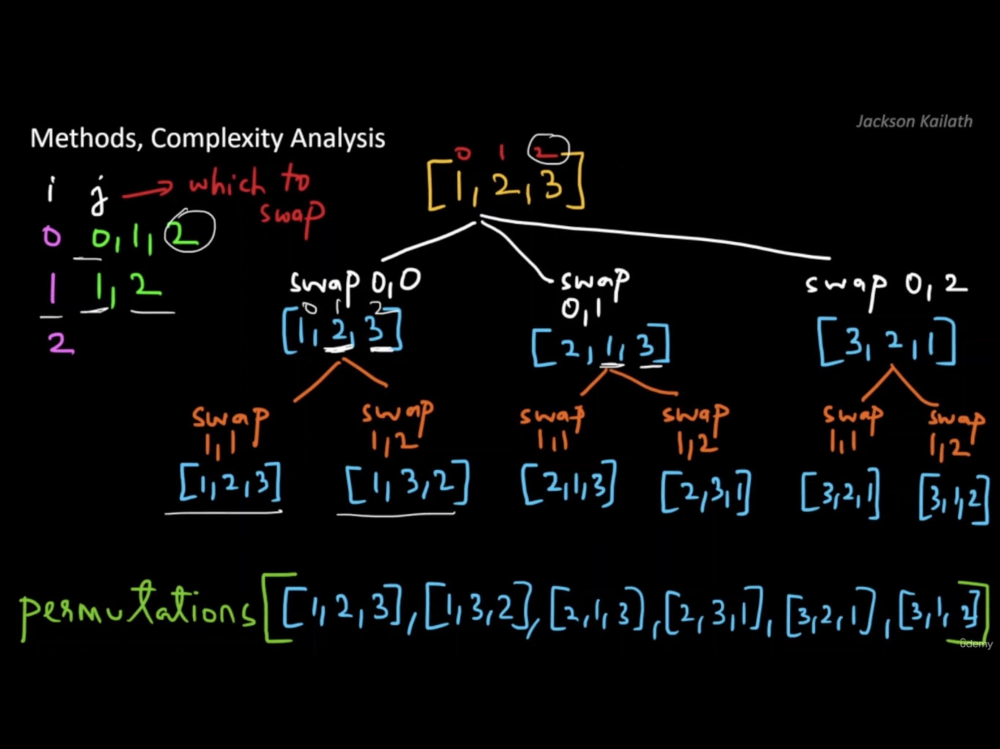

```js
// Time: O(n! * n) - Space: O(n! * n)
function allPermutation(nums) {
  const permutation = [];
  function helper(nums, i) {
    if (i === nums.length - 1) {
      permutation.push(nums.slice());
      return;
    }
    for (let j = i; j < nums.length; j++) {
      [nums[i], nums[j]] = [nums[j], nums[i]];
      helper(nums, i + 1);
      [nums[i], nums[j]] = [nums[j], nums[i]];
    }
  }
  helper(nums, 0);
  return permutation;
}

console.log(allPermutation([1, 2, 3]));
```

#### Power Set

Given an integer array of unique elements, return all possible subsets (the power set). The solution set must not contain duplicate subsets. Return the solution in any order.

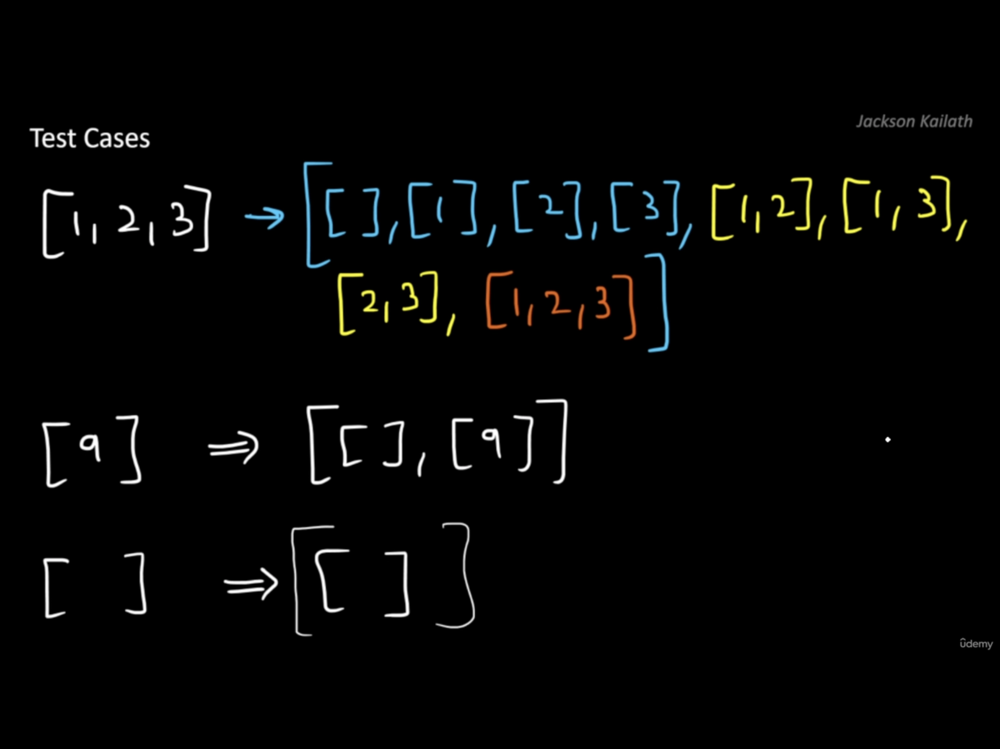
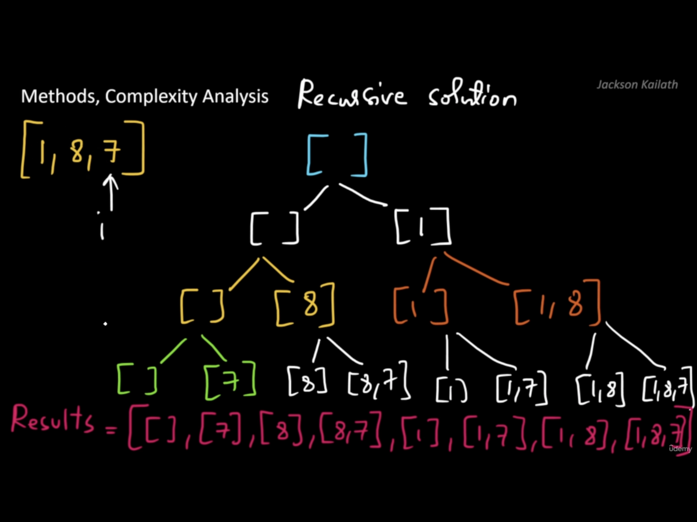

```js
// Solution 1
// Time: O(2^n * n) - Space: O(2^n * n)
function powerSet(nums) {
  const output = [];
  const helper = function (i, subset) {
    if (i === nums.length) {
      output.push(subset.slice());
      return;
    }
    // don't include the number
    helper(i + 1, subset);
    // include the number
    subset.push(nums[i]);
    helper(i + 1, subset);
    subset.pop();
  };
  helper(0, []);
  return output;
}

// Solution 2
function powerSet(nums) {
  const powerSet = [];
  function backtrack(start, subset) {
    powerSet.push(subset.slice());
    for (let i = start; i < nums.length; i++) {
      subset.push(nums[i]);
      backtrack(i + 1, subset);
      subset.pop();
    }
  }
  backtrack(0, []);
  return powerSet;
}

console.log(powerSet([1, 8, 7]));
// [[], [7], [8], [8, 7], [1], [1, 7], [1, 8], [1, 8, 7]]
// [[], [1], [1, 8], [1, 8, 7], [1, 7], [8], [8, 7], [7]]
console.log(powerSet([1, 2, 3]));
// [[], [3], [2], [2, 3], [1], [1, 3], [1, 2], [1, 2, 3]]
// [[], [1], [1, 2], [1, 2, 3], [1, 3], [2], [2, 3], [3]]
```

### STRING

#### Non repeating character

You are given a string consisting of only lower case and upper-case English Alphabets and integers 0 to 9. Write a function that will take this string as Input and return the index of the first character that is non-repeating.

##### Clarifying questions:

- What if there is no non-repeating character? - return null
- If 'a' and 'A' are given, are they considered the same character? - no

```js
// Method 1: Brute force
// Time: O(n^2) - Space: O(1)
function findNonRepeatingCharacter(string) {
  for (let i = 0; i < string.length; i++) {
    let repeat = false;
    for (let j = 0; j < string.length; j++) {
      if (i !== j && string[i] === string[j]) {
        repeat = true;
        break;
      }
    }
    if (!repeat) return i;
  }
  return null;
}

// Method 2: Hash table
// Time: O(n) - Space: O(1)
// Maximum character numbers are 26(A-Z) + 26(a-z) + 10(0-9) = 62, so the space complexity is O(1)
function findNonRepeatingCharacter(string) {
  const hashTable = {};
  for (let i = 0; i < string.length; i++) {
    hashTable[string[i]] ? hashTable[string[i]]++ : (hashTable[string[i]] = 1);
  }
  for (let i = 0; i < string.length; i++) {
    if (hashTable[string[i]] === 1) return i;
  }
  return null;
}

let a = "aabbcc";
let b = "abcAabc";
console.log(findNonRepeatingCharacter(a)); // null
console.log(findNonRepeatingCharacter(b)); // 3
```

#### Palindrome

You are given a string. Write a function to check whether the string is a palindrome or not.

##### Clarifying questions:

- Is a single character string treated as a Palindrome? - yes
- What should happen if the string input is empty? - you can assume it is non-empty
- What should be the output of the function? - true or false
- Should lowercase and uppercase be treated as different? - yes

```js
// Method 1
// Time: O(n^2) - Space: O(n)
function isPalindromeCheck(string) {
  let newStringtoCompare = ""; // String
  for (let i = string.length - 1; i >= 0; i--) {
    newStringtoCompare += string[i]; // strings are immutable in JS, so the operation of appending string takes O(n) time complexity
  }
  if (newStringtoCompare === string) return true;
  return false;
}

// Method 2
// Time: O(n) - Space: O(n)
function isPalindromeCheck(string) {
  let newStringtoCompare = []; // Array
  for (let i = string.length - 1; i >= 0; i--) {
    newStringtoCompare.push(string[i]);
  }
  if (newStringtoCompare.join("") === string) return true;
  return false;
}

// Method 3
// Time: O(n) - Space: O(1)
function isPalindromeCheck(string) {
  let i = 0;
  let j = string.length - 1;
  while (i < j) {
    if (string[i] !== string[j]) return false;
    i++;
    j--;
  }
  return true;
}

let a = "abcba";
let b = "aaced";
console.log(isPalindromeCheck(a)); // true
console.log(isPalindromeCheck(b)); // false
```

#### Longest Unique char Substring

Given a string s, find the length of the longest substring without repeating characters.


```js
// Time: O(n) - Space: O(m): m is the number of unique characters in the string
function maxLength(string) {
  let max = 0;
  let start = 0;
  const visited = {};
  for (let i = 0; i < string.length; i++) {
    const char = string[i];
    if (char in visited) {
      start = Math.max(start, visited[char] + 1);
    }
    max = Math.max(max, i - start + 1);
    visited[char] = i;
  }
  return max;
}

console.log(maxLength("abcdb")); // 4 abcd
console.log(maxLength("pqbrstbuvwpvy")); // 8 rstbuvwp
```

#### Group Anagrams

Given an array of strings consisting of lower case English letters, group the anagrams together. You can return the answer in any order. An Anagram is a word or phrase formed by rearranging the letters of a different word or phrase, using all the original letters exactly once.

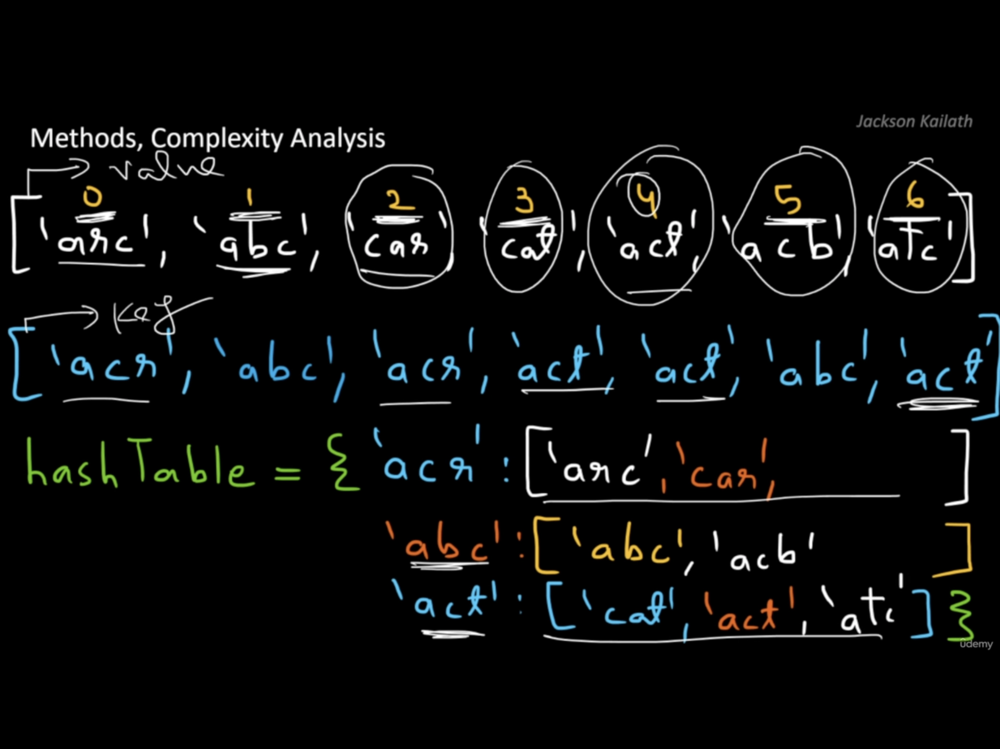

```js
// Time: O(s * nlogn) - Space: O(s * n) : s -> number of strings, n -> max number of characters in a string
function groupAnagrams(strings) {
  const sorted = strings.map((str) => str.split("").sort().join(""));
  const hashTable = {};
  for (let i = 0; i < strings.length; i++) {
    hashTable[sorted[i]] ? hashTable[sorted[i]].push(strings[i]) : (hashTable[sorted[i]] = [strings[i]]);
  }
  return Object.values(hashTable);
}

let a = ["eat", "tea", "tan", "ate", "nat", "bat", "tab"];
console.log(groupAnagrams(a));
// [ [ 'eat', 'tea', 'ate' ], [ 'tan', 'nat' ], [ 'bat', 'tab' ] ]
```

### SEARCHING

#### Binary Search

Given an array of integers which is sorted in ascending order, and a target integer, write a function to search for whether the target integer is there in the given array. If it is there then return its index. Otherwise, return -1. You must write an algorithm with O(log n) runtime complexity.

```js
// Time: O(logn) - Space: O(1)
function binarySearchIterative(nums, target) {
  let left = 0;
  let right = nums.length - 1;
  while (left <= right) {
    let mid = Math.floor((left + right) / 2);
    if (nums[mid] === target) return mid;
    if (nums[mid] < target) left = mid + 1;
    else right = mid - 1;
  }
  return -1;
}

// Time: O(logn) - Space: O(logn)
function binarySearchRecursive(nums, target) {
  function helper(left, right) {
    if (left > right) return -1;
    let mid = Math.floor((left + right) / 2);
    if (nums[mid] === target) return mid;
    if (nums[mid] < target) return helper(mid + 1, right);
    return helper(left, mid - 1);
  }
  return helper(0, nums.length - 1);
}

let a = [1, 2, 3, 4, 5, 6, 7, 8, 9];
console.log(binarySearchIterative(a, 5)); // 4
console.log(binarySearchRecursive(a, 5)); // 4
```

#### Search in Rotated Sorted array

You are given an integer array nums sorted in ascending order (with distinct values). Prior to being passed to your function, nums is possibly rotated at an unknown pivot index k (1 <= k < nums.length) such that the resulting array is [nums[k], nums[k+1], ..., nums[n-1], nums[0], nums[1], ..., nums[k-1]] (0-indexed).
For example, [0,1,2,4,5,6,7] might be rotated at pivot index 3 and become [4,5,6,7,0,1,2]. Given an integer target, return the index of target if it is in the array, else return -1. You must write an algorithm with O(log n) runtime complexity.


```js
// Time: O(logn) - Space: O(1)
function searchRotatedSortedArray(nums, target) {
  let left = 0;
  let right = nums.length - 1;
  let mid;
  while (left <= right) {
    mid = Math.floor((left + right) / 2);
    if (nums[mid] === target) return mid;
    if (nums[left] <= nums[mid]) {
      // left part is sorted
      if (nums[left] <= target && target < nums[mid]) {
        // target is in the left part
        right = mid - 1;
      } else {
        // target is in the right part
        left = mid + 1;
      }
    } else {
      // right part is sorted
      if (nums[mid] < target && target <= nums[right]) {
        // target is in the right part
        left = mid + 1;
      } else {
        // target is in the left part
        right = mid - 1;
      }
    }
  }
  return -1;
}

console.log(searchRotatedSortedArray([4, 5, 6, 7, 0, 1, 2], 0)); // 4
console.log(searchRotatedSortedArray([3, 4, 5, 6, 1, 2], 6)); // 3
```

#### Find First and Last Position of Element in Sorted Array

You are given an array of integers sorted in non-decreasing order, find the starting and ending position of a given target value. If target is not found in the array, return [-1, -1]. You must write an algorithm with O(log n) runtime complexity.

```js
// Time: O(logn) - Space: O(logn)
function searchForRangeRec(array, target) {
  const range = [-1, -1];
  findLeftExtreme(0, array.length - 1);
  findRightExtreme(0, array.length - 1);
  return range;

  function findLeftExtreme(left, right) {
    if (left > right) return;
    const mid = Math.floor((left + right) / 2);
    if (array[mid] === target) {
      if (mid === 0) range[0] = mid;
      else if (array[mid - 1] === target) findLeftExtreme(left, mid - 1);
      else range[0] = mid;
    } else if (target < array[mid]) findLeftExtreme(left, mid - 1);
    else findLeftExtreme(mid + 1, right);
  }

  function findRightExtreme(left, right) {
    if (left > right) return;
    const mid = Math.floor((left + right) / 2);
    if (array[mid] === target) {
      if (mid === array.length - 1) range[1] = mid;
      else if (array[mid + 1] === target) findRightExtreme(mid + 1, right);
      else range[1] = mid;
    } else if (target < array[mid]) findRightExtreme(left, mid - 1);
    else findRightExtreme(mid + 1, right);
  }
}

// Iterative solution
// Time: O(logn) - Space: O(1)
function searchForRangeIterative(array, target) {
  const leftExtreme = findLeftExtreme(array, target);
  const rightExtreme = findRightExtreme(array, target);
  return [leftExtreme, rightExtreme];

  function findLeftExtreme(array, target) {
    let left = 0;
    let right = array.length - 1;
    while (left <= right) {
      const mid = Math.floor((left + right) / 2);
      if (array[mid] === target) {
        if (mid === 0) return mid;
        if (array[mid - 1] === target) right = mid - 1;
        else return mid;
      } else if (target < array[mid]) right = mid - 1;
      else left = mid + 1;
    }
    return -1;
  }

  function findRightExtreme(array, target) {
    let left = 0;
    let right = array.length - 1;
    while (left <= right) {
      const mid = Math.floor((left + right) / 2);
      if (array[mid] === target) {
        if (mid === array.length - 1) return mid;
        if (array[mid + 1] === target) left = mid + 1;
        else return mid;
      } else if (target < array[mid]) right = mid - 1;
      else left = mid + 1;
    }
    return -1;
  }
}

console.log(searchForRangeRec([5, 7, 7, 8, 8, 10], 8)); // [3, 4]
console.log(searchForRangeRec([5, 7, 7, 7, 8, 10], 7)); // [1, 3]
console.log(searchForRangeIterative([5, 7, 7, 8, 8, 10], 8)); // [3, 4]
console.log(searchForRangeIterative([5, 7, 7, 7, 8, 10], 7)); // [1, 3]
```

#### Search in 2D Array

Write an efficient algorithm that searches for a value target in an m x n integer matrix. This matrix has the following properties:

- Integers in each row are sorted from left to right.
- The first integer of each row is greater than the last integer of the previous row. If the value is there in the matrix return true, else false.

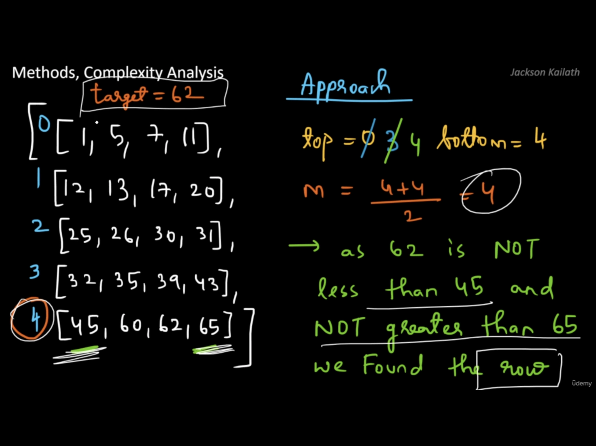
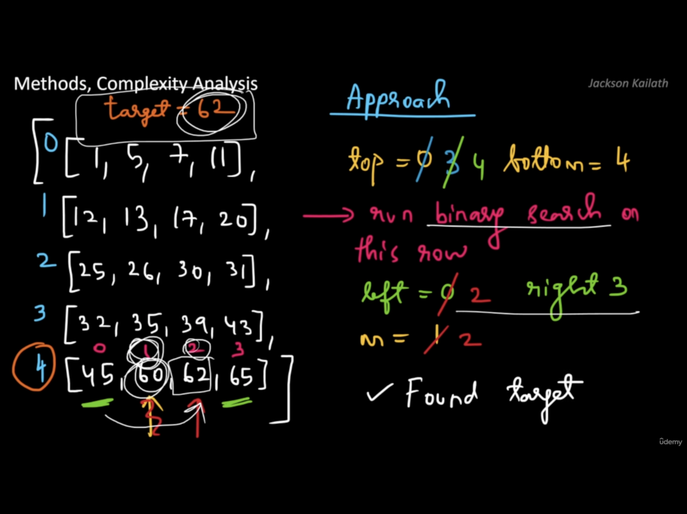

```js
// Time: O(logmn) - Space: O(1) : m -> number of rows, n -> number of columns, logmn = logm + logn
function searchInMatrix(matrix, target) {
  const cols = matrix[0].length;
  const rows = matrix.length;
  // Binary search to identify the row
  let top = 0;
  let bottom = rows - 1;
  let middle;
  while (top <= bottom) {
    middle = Math.floor((top + bottom) / 2);
    if (matrix[middle][0] > target) bottom = middle - 1;
    else if (matrix[middle][cols - 1] < target) top = middle + 1;
    else break;
  }
  if (top > bottom) return false;
  // Binary search to identify the column
  let left = 0;
  let right = cols - 1;
  while (left <= right) {
    let mid = Math.floor((left + right) / 2);
    if (matrix[middle][mid] === target) return true;
    if (matrix[middle][mid] < target) left = mid + 1;
    else right = mid - 1;
  }
  return false;
}

let a = [
  [1, 3, 5, 7],
  [10, 11, 16, 20],
  [23, 30, 34, 60],
];
console.log(searchInMatrix(a, 31)); // false
console.log(searchInMatrix(a, 16)); // true
```

### SORTING

#### Bubble Sort

You are given an array of integers. Write a function that will take this array as input and return the sorted array using Bubble sort.

```js
// Time: O(n^2) - Space: O(1)
function bubbleSort(array) {
  let isSorted = false;
  let counter = 0;
  let length = array.length;
  while (!isSorted) {
    isSorted = true;
    for (let i = 0; i < length - 1 - counter; i++) {
      if (array[i] > array[i + 1]) {
        [array[i], array[i + 1]] = [array[i + 1], array[i]];
        isSorted = false;
      }
    }
    counter++;
  }
  return array;
}

let a = [8, 5, 2, 9, 5, 6, 3];
let b = [1, 2, 3, 4, 5];
let c = [5, 4, 3, 2, 1];
console.log(bubbleSort(a)); // [2, 3, 5, 5, 6, 8, 9]
console.log(bubbleSort(b)); // [1, 2, 3, 4, 5]
console.log(bubbleSort(c)); // [1, 2, 3, 4, 5]
```

#### Insertion Sort

You are given an array of integers. Write a function that will take this array as input and return the sorted array using Insertion sort.

```js
// Insertion Sort
// Time: O(n^2) - Space: O(1)
function insertionSort(array) {
  for (let i = 1; i < array.length; i++) {
    let j = i;
    while (j > 0 && array[j] < array[j - 1]) {
      [array[j], array[j - 1]] = [array[j - 1], array[j]];
      j--;
    }
  }
  return array;
}
let a = [8, 5, 2, 9, 5, 6, 3];
let b = [1, 2, 3, 4, 5];
let c = [5, 4, 3, 2, 1];
console.log(insertionSort(a)); // [2, 3, 5, 5, 6, 8, 9]
console.log(insertionSort(b)); // [1, 2, 3, 4, 5]
console.log(insertionSort(c)); // [1, 2, 3, 4, 5]
```

#### Selection Sort

You are given an array of integers. Write a function that will take this array as input and return the sorted array using Selection sort.

```js
// Time: O(n^2) - Space: O(1)
function selectionSort(array) {
  for (let i = 0; i < array.length; i++) {
    let minIndex = i;
    for (let j = i + 1; j < array.length; j++) {
      if (array[j] < array[minIndex]) {
        minIndex = j;
      }
    }
    [array[i], array[minIndex]] = [array[minIndex], array[i]];
  }
  return array;
}

let a = [8, 5, 2, 9, 5, 6, 3];
let b = [1, 2, 3, 4, 5];
let c = [5, 4, 3, 2, 1];
console.log(selectionSort(a)); // [2, 3, 5, 5, 6, 8, 9]
console.log(selectionSort(b)); // [1, 2, 3, 4, 5]
console.log(selectionSort(c)); // [1, 2, 3, 4, 5]
```

#### Merge Sort

You are given an array of integers. Write a function that will take this array as input and return the sorted array using Merge sort.

```js
// Time: O(nlogn) - Space: O(n)
function mergeSort(array) {
  if (array.length <= 1) return array;
  const middle = Math.floor(array.length / 2);
  const left = mergeSort(array.slice(0, middle));
  const right = mergeSort(array.slice(middle));
  return merge(left, right);

  function merge(left, right) {
    const result = [];
    let i = 0;
    let j = 0;
    while (i < left.length && j < right.length) {
      // using "<=" instead of "<" to make the merge sort become the "stable sorting algorithm"
      if (left[i] <= right[j]) {
        result.push(left[i]);
        i++;
      } else {
        result.push(right[j]);
        j++;
      }
    }
    while (i < left.length) {
      result.push(left[i]);
      i++;
    }
    while (j < right.length) {
      result.push(right[j]);
      j++;
    }
    return result;
  }
}

let a = [8, 5, 2, 9, 5, 6, 3];
let b = [1, 2, 3, 4, 5];
let c = [5, 4, 3, 2, 1];
console.log(mergeSort(a)); // [2, 3, 5, 5, 6, 8, 9]
console.log(mergeSort(b)); // [1, 2, 3, 4, 5]
console.log(mergeSort(c)); // [1, 2, 3, 4, 5]
```

#### Quick Sort

You are given an array of integers. Write a function that will take this array as input and return the sorted array using Quick sort.


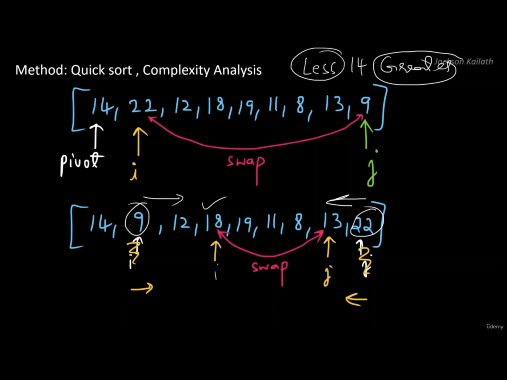


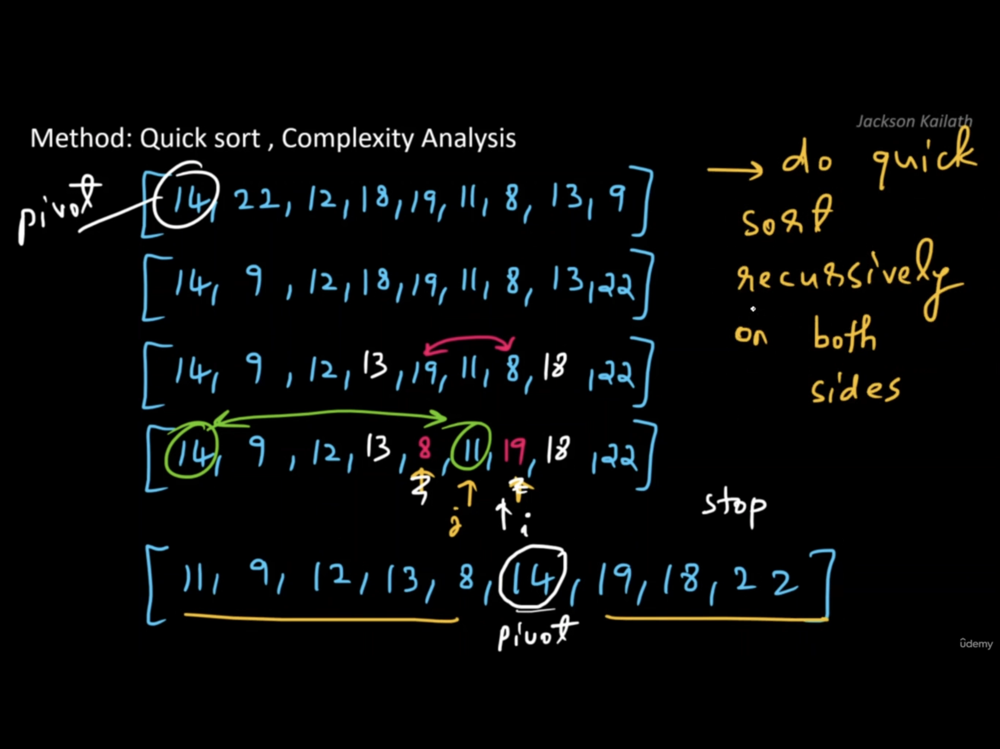

```js
// Time: O(nlogn) - Space: O(logn)

function swap(array, i, j) {
  [array[i], array[j]] = [array[j], array[i]];
}

function partition(array, start = 0, end = array.length - 1) {
  let middle = Math.floor((start + end) / 2);
  swap(array, start, middle);

  let pivot = array[start];
  let i = start + 1;
  let j = end;

  while (i <= j) {
    while (array[i] <= pivot) {
      i++;
    }
    while (array[j] > pivot) {
      j--;
    }
    if (i < j) {
      swap(array, i, j);
    }
  }
  swap(array, start, j);
  return j;
}

function quickSort(array, start = 0, end = array.length - 1) {
  if (start < end) {
    let index = partition(array, start, end);
    quickSort(array, start, index - 1);
    quickSort(array, index + 1, end);
  }
  return array;
}

let a = [8, 5, 2, 9, 5, 6, 3];
let b = [1, 2, 3, 4, 5];
let c = [5, 4, 3, 2, 1];
console.log(quickSort(a)); // [2, 3, 5, 5, 6, 8, 9]
console.log(quickSort(b)); // [1, 2, 3, 4, 5]
console.log(quickSort(c)); // [1, 2, 3, 4, 5]
```

#### Radix Sort

You are given an array of **non-negative** integers. Write a function that will take this array as input and return the sorted array using Radix sort.

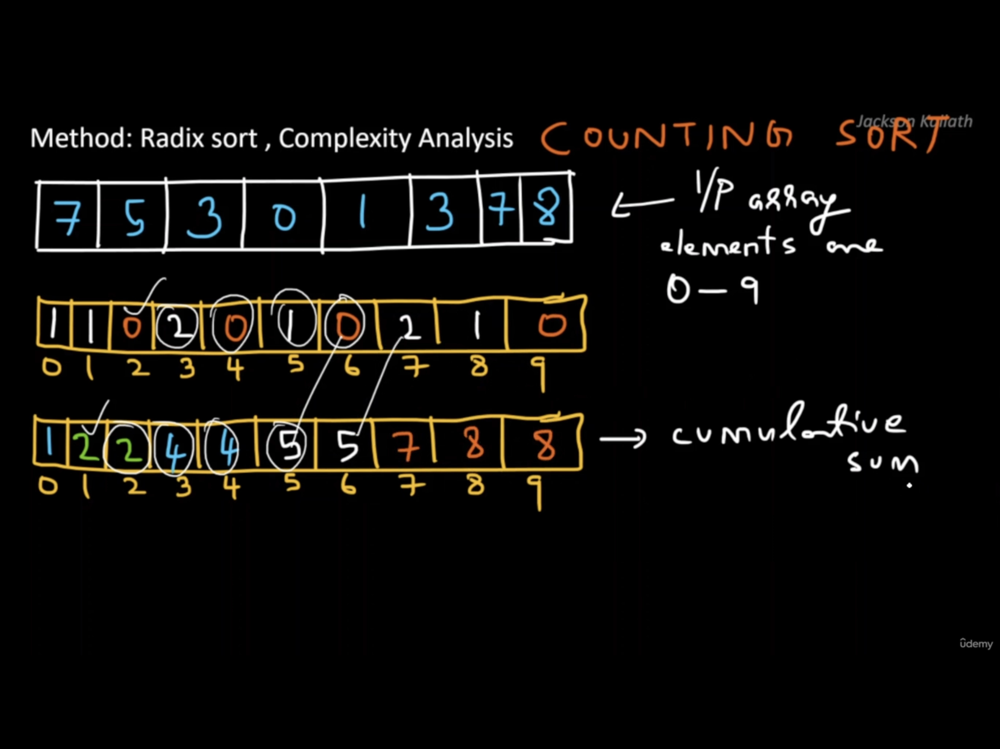
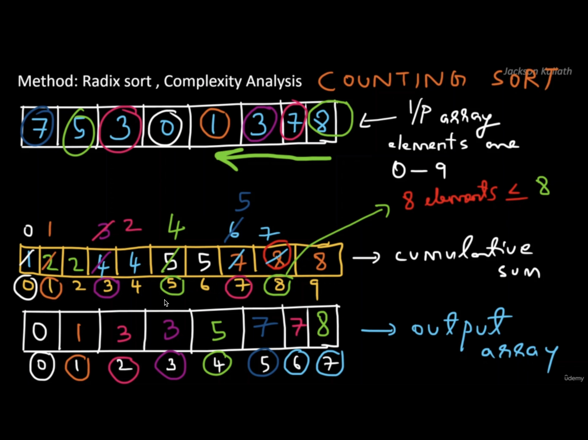


```js
// Counting Sort
// Time: O(n + k) - Space: O(n + k) : n -> number of elements, k -> range of input, if base 10, k = 10

// Radix Sort
// Time: O(d * (n + k)) - Space: O(n + k) : d -> number of digits in the greatest number, n -> number of elements, k -> range of input, if base 10, k = 10
function radixSort(array) {
  if (array.length === 0) return array;
  const greatestNumber = Math.max(...array);
  const numberOfDigits = Math.floor(Math.log10(greatestNumber) + 1);
  // Counting sort has to be done x number of times, where x is the number of digits in the greatest number
  for (let i = 0; i < numberOfDigits; i++) {
    countingSort(array, i);
  }
  return array;
}

function countingSort(array, place) {
  const output = new Array(array.length).fill(0);
  const temp = new Array(10).fill(0);
  const digitPlace = Math.pow(10, place);

  for (let num of array) {
    let digit = Math.floor(num / digitPlace) % 10;
    temp[digit]++;
  }

  // get cumulative sum of temp
  for (let i = 1; i < 10; i++) {
    temp[i] += temp[i - 1];
  }

  for (let j = array.length - 1; j >= 0; j--) {
    let digit = Math.floor(array[j] / digitPlace) % 10;
    temp[digit]--;
    output[temp[digit]] = array[j];
  }

  for (let i = 0; i < array.length; i++) {
    array[i] = output[i];
  }
}

let a = [384, 73, 374, 183, 65, 247, 185];
console.log(radixSort(a)); // [65, 73, 183, 185, 247, 374, 384]
```

### SINGLY LINKED LIST

#### Construct SLL

Design a Singly linked list class that has a head and tail. Every node is to have two attributes: **value**: the value of the current node, and **next**: a pointer to the next node. The linked list is to be 0-indexed. The class should support the following:

- SinglyLinkedList() Initializes the SinglyLinkedList object.
- get(index) Get the value of the index-th node. If the index is invalid, return -1.
- addAtHead(value) - Add a node of given value before the first element of the linked list.
- addAtTail(value) - Add a node of given value at the last element of the linked list.
- addAtIndex(index, value) Add a node of given value before the index-th node in the linked list. If index equals the length of the linked list, the node will be appended to the end of the linked list. If index is greater than the length, don’t insert the node.
- deleteAtIndex(index) Delete the index-th node in the linked list, if the index is valid, else nothing happens.

```js
class Node {
  constructor(value) {
    this.value = value;
    this.next = null;
  }
}

class SinglyLinkedList {
  constructor() {
    this.head = null;
    this.tail = null;
    this.size = 0;
  }
  get(index) {
    if (index < 0 || index >= this.size) return -1;
    let count = 0;
    let current = this.head;
    while (count != index) {
      current = current.next;
      count++;
    }
    return current;
  }
  addAtHead(value) {
    const node = new Node(value);
    if (!this.head) {
      this.head = node;
      this.tail = node;
    } else {
      node.next = this.head;
      this.head = node;
    }
    this.size++;
    return this;
  }
  addAtTail(value) {
    const node = new Node(value);
    if (!this.head) {
      this.head = node;
      this.tail = node;
    } else {
      this.tail.next = node;
      this.tail = node;
    }
    this.size++;
    return this;
  }
  addAtIndex(index, value) {
    if (index < 0 || index > this.size) return "Invalid index!";
    if (index === this.size) return this.addAtTail(value);
    if (index === 0) return this.addAtHead(value);
    const node = new Node(value); // 1->2->3->null  1->5->2->3->null
    let prev = this.get(index - 1);
    let temp = prev.next;
    prev.next = node;
    node.next = temp;
    this.size++;
    return this;
  }
  deleteAtIndex(index) {
    if (index < 0 || index >= this.size) return "Invalid index!";
    if (index === 0) {
      // delete head
      let temp = this.head;
      this.head = temp.next;
      this.size--;
      if (this.size === 0) {
        this.tail = null;
      }
      return temp;
    }
    if (index === this.size - 1) {
      // delete tail
      let oldTail = this.tail;
      let newTail = this.get(index - 1);
      this.tail = newTail;
      newTail.next = null;
      this.size--;
      return oldTail;
    }
    // delete other node
    let prev = this.get(index - 1);
    let deletedNode = prev.next;
    prev.next = deletedNode.next;
    this.size--;
    return deletedNode;
  }
}

const sl = new SinglyLinkedList();
sl.addAtHead(1);
sl.addAtTail(2);
sl.addAtIndex(2, 3);
console.log(sl.get(2));
console.log(sl.deleteAtIndex(0));
console.log(sl);
```
